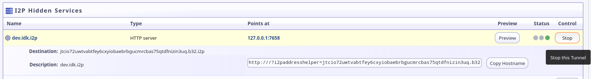
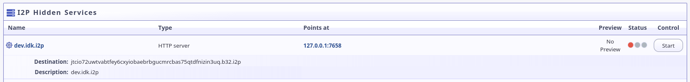
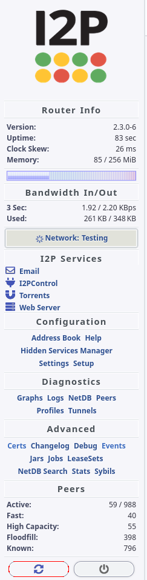

# Gitbucket over I2P Tutorial

As many people already know, I operate the gitlab server at [`i2pgit.org`](https://i2pgit.org) and [`git.idk.i2p`](http://git.idk.i2p), however, I would not recommend Gitlab for a small operation like the one I donate to I2P. Self-Hosting gitlab is difficult, demanding, and time-consuming due to the need to update gitlab very frequently in order to keep up with security updates, and the tendency of gitlab updates to break the gitlab instance. We use gitlab for I2P right now because of it's many advanced features, but there are several far simpler git hosts available to set up over I2P.

One git host which is especially easy to deply on the Java I2P distribution is the "Gitbucket" git host, which is written is Scala, a JVM compatible language, and which uses Servlet 3.0, making it compatible with the "Jetty" web server used in Java I2P to provide a default hidden service.

Servlet is a Java technology which is used to deploy webapps to a web server. Java I2P is compatible with Servlet 3.0. In order to deploy a webapp to Java I2P, one needs to:

 1. Stop the HTTP Server Tunnel
 2. Download the webapp and configure it's dependencies.
 3. Place the webapp into the `$I2P/eepsite/webapps/` directory
 4. Restart I2P

Let's use Gitbucket as an example.

**First**, go to the I2P Hidden Services Manager and "Stop" the hidden service for the default HTTP Server as seen below:

- Before: 
- 

- After:
- 

**Next**, download the Gitbucket `.war` file somewhere. You can download it directly to the `$I2P/eepsite/webapps/` directory if you want, but it may be better to download it somwhere else and copy it where you need to later.

 - Using the terminal:

```sh
release_tag=$(wget -O - https://api.github.com/repos/gitbucket/gitbucket/releases/latest | jq -r ".tag_name")
wget -O ~/Downloads/gitbucket.war https://github.com/gitbucket/gitbucket/releases/download/$release_tag/gitbucket.war
```

- Using a Web Browser: Visit `https://github.com/gitbucket/gitbucket/releases/latest` in your browser and click the `gitbucket.war` download.
- 

**Then**, copy the `gitbucket.war` file into the `$I2P/eepsite/webapps/` directory.

 - Using the Terminal:

```sh
cp ~/Downloads/gitbucket.war ~/.i2p/eepsite/webapps/gitbucket.war
```

 - Using the File Navigator:

**Finally**, re-start the I2P router and test the gitbucket

 - Using the terminal:

```sh
i2prouter graceful
while i2prouter status | grep STARTED; do sleep 10s; done
i2prouter start
```

 - Using a web browser: Click the highlighted(Red) button in the bottom of the sidebar: 

